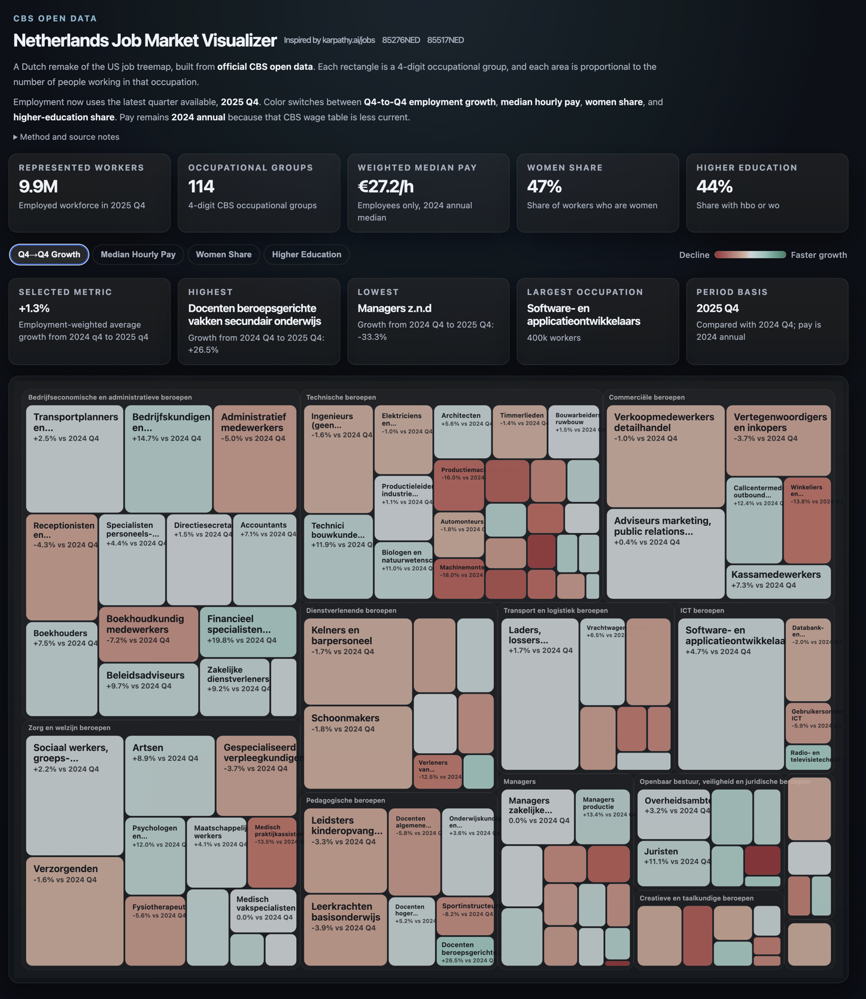

# Netherlands Job Market Visualizer

A static, CBS-backed remake of [karpathy.ai/jobs](https://karpathy.ai/jobs/) for the Dutch labor market.



It renders a treemap of Dutch occupations using official CBS open data:

- tile area: employed workforce by occupation
- growth color mode: `2024 Q4 -> 2025 Q4`
- pay color mode: `2024 annual` median hourly pay
- additional color modes: women share and higher-education share

## Data sources

- `85276NED` - Werkzame beroepsbevolking; beroep
- `85517NED` - Werknemers; uurloon en beroep

The employment side uses the latest quarterly occupation data available from CBS: `2025 Q4`, compared against `2024 Q4`.
The pay table is less current, so wage data remains on the latest available annual release: `2024`.

## What’s included

- `site/index.html`: a static treemap UI inspired by the original Karpathy jobs page
- `site/data.json`: generated merged occupation dataset
- `scripts/fetch-cbs-data.mjs`: pulls and transforms CBS OData into the site payload

## Commands

```bash
npm run build:data
npm run serve
```

Then open [http://127.0.0.1:8000](http://127.0.0.1:8000).
